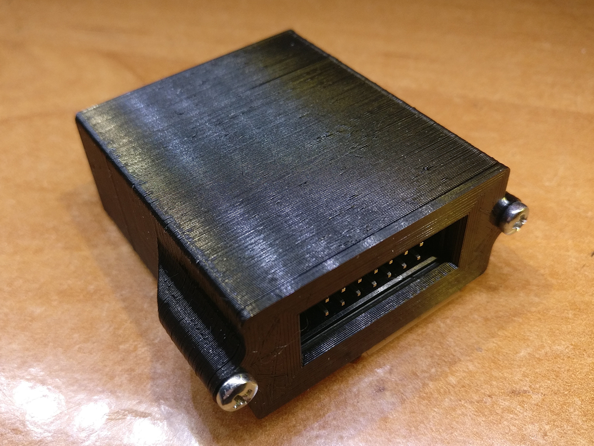
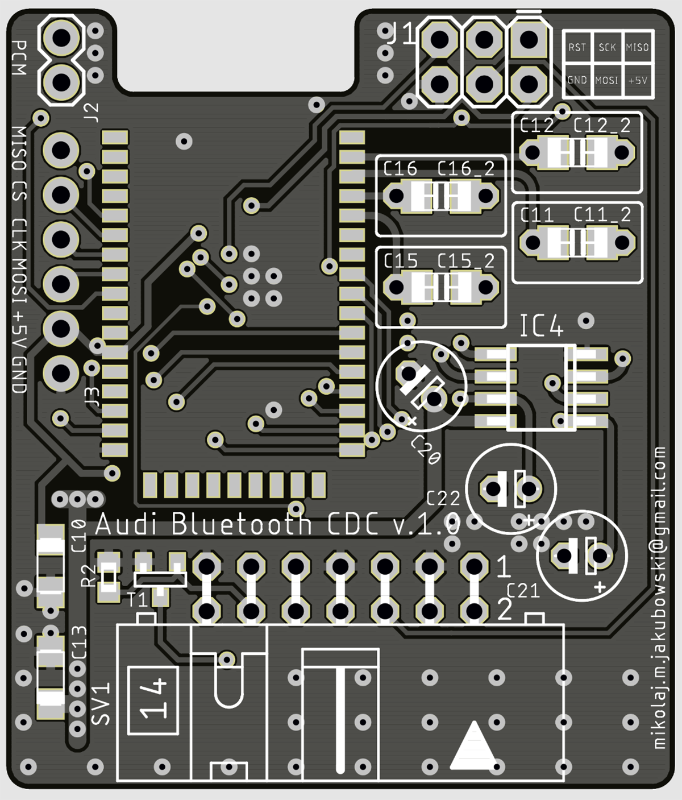
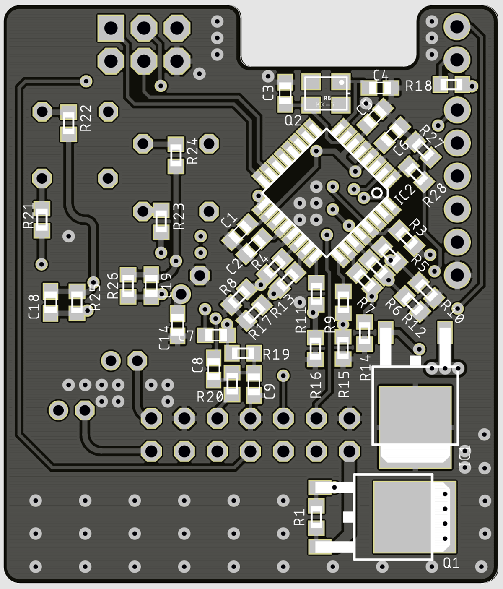
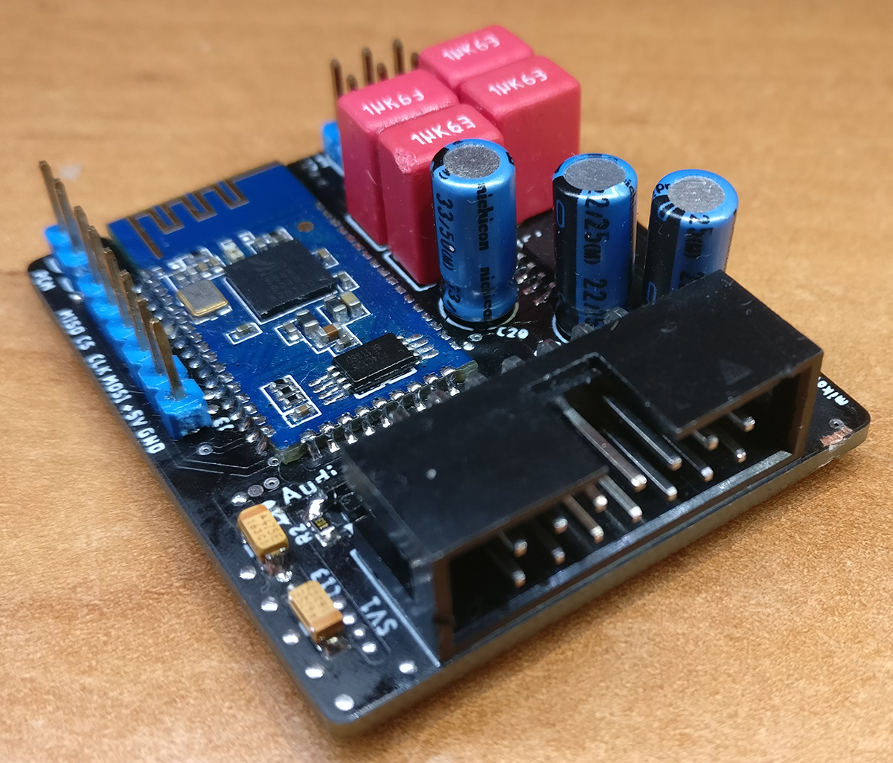

# Audi Bluetooth CDC - emulator zmieniarki CD

## Cechy:
* symulacja pracy fabrycznej zmieniarki CD dla samochodów grupy VAG
* kontrola odtwarzania z przycisków radia
* łączność za pośrednictwem Bluetooth 4.1
* profile: HFP 1.6, A2DP 1.2, AVRCP 1.4
* kodek Qualcomm® aptX™
* wzmacniacz operacyjny OPA2134 Burr Brown
* zestaw głośnomówiący
* obsługa asystenta głosowego
* automatyczne włączenie/wyłączanie
* kompaktowe rozmiary
---

